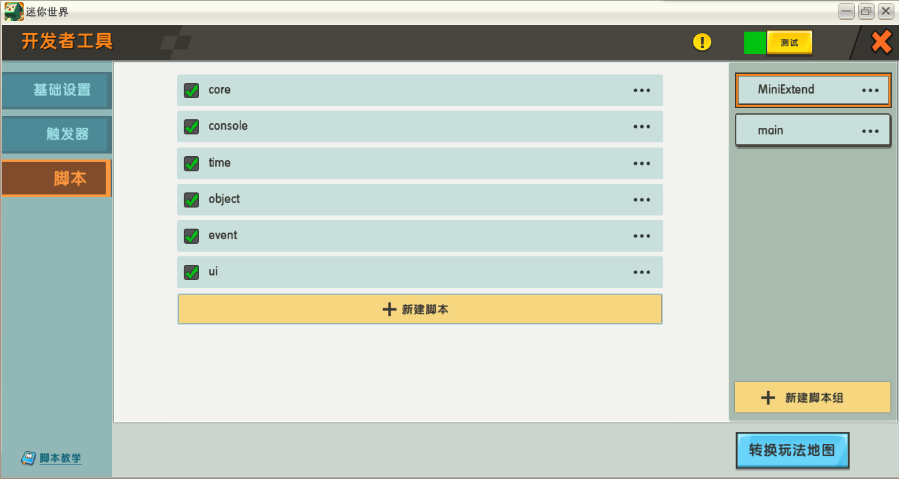
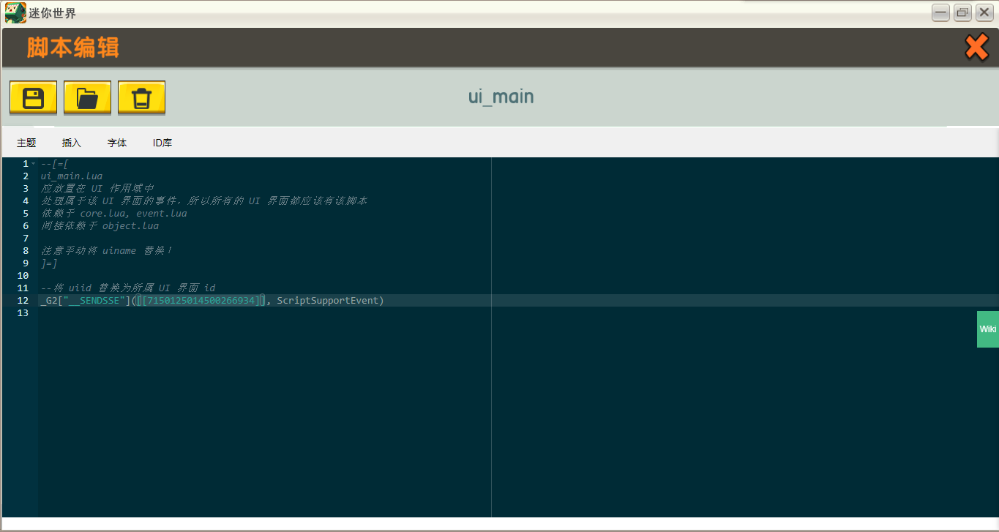
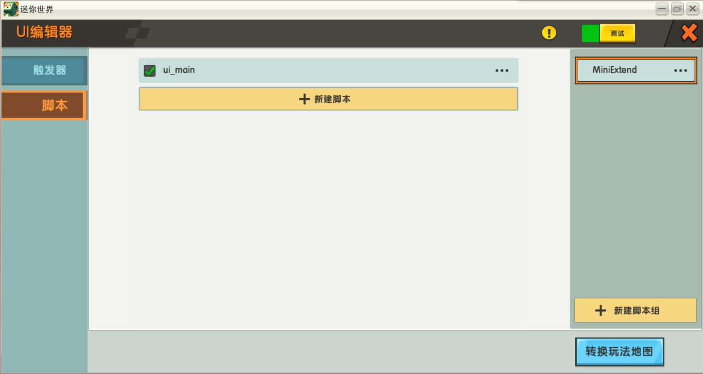
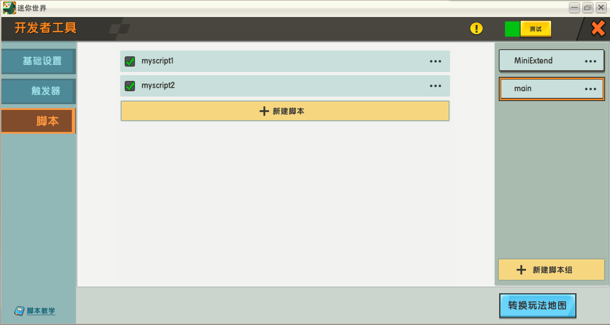
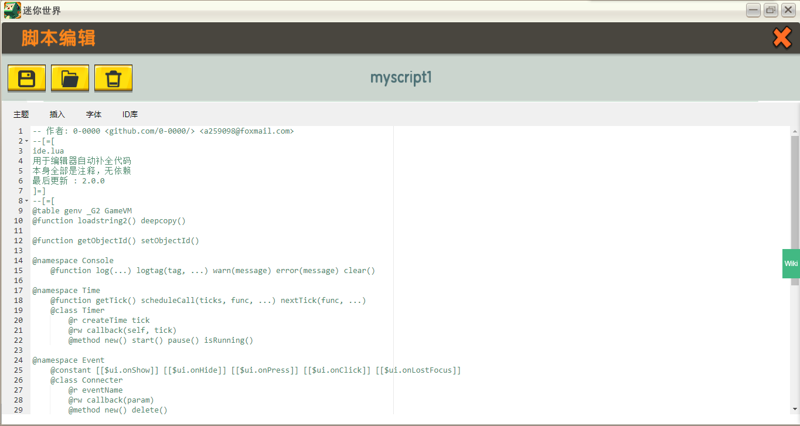
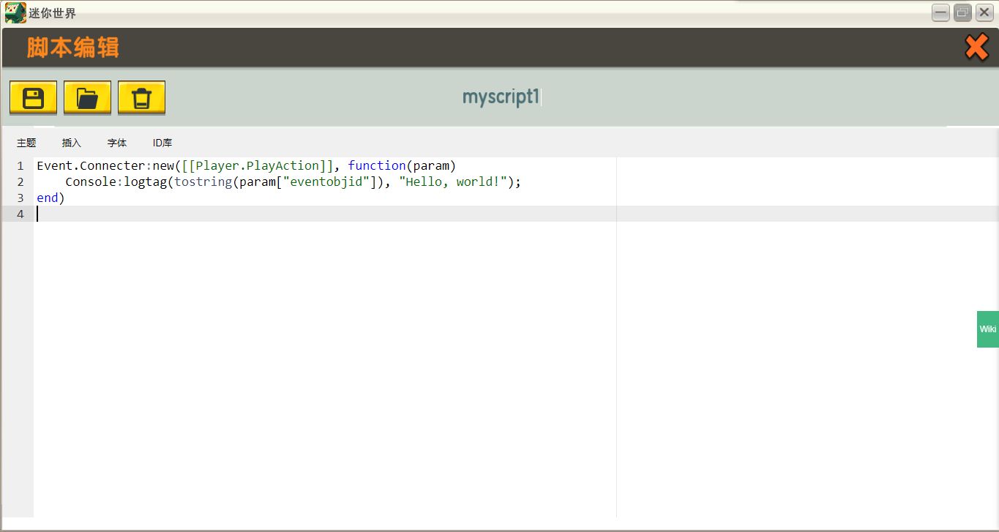

# MiniExtend 搭建环境 #
## 初始化全局作用域下的脚本 ##
关于作用域，参见[定义](./document.html#脚本作用域)。  
在全局作用域下，按<u title="源代码开头显示了它们依赖的脚本">一定顺序</u>加入这些脚本。  
打开 *src/* 文件夹可以看到 MiniExtend 源代码。  
以下是一个合法的顺序(注意脚本名忽略了 *.lua* 后缀)，你可以按照该顺序来创建脚本:  
1. *core*  
2. *console*  
3. *time*  
4. *object*  
5. *event*  
6. *ui*  

直接将源代码复制到脚本中即可，也可以使用打开 *src/* 文件夹选择源代码文件加载。  
完成后界面应如图所示，这里使用 MiniExtend 脚本组管理 MiniExtend 脚本， main 脚本组管理自己的脚本。  
  
图中的脚本和脚本组都是有命名的，这些命名不会影响 MiniExtend 正常运行，但良好的命名习惯有利于你在错误发生时及时发现错误的脚本。  

## 自定义 UI 环境 ##
对于**所有** UI 作用域，创建 *ui_main* 脚本，对应源文件为 *ui_main.lua* ，然后将 `uiid` 替换为所属 UI 界面 id 。  
注: UI 界面创建时，对应作用域下可能会自动创建一个<u title="该触发器会使得玩家自动打开该 UI 界面">触发器</u>，创建条件不明，你应该**将其删除**。  
  
  

## 正式开始使用 MiniExtend ##
做完以上操作，你已经成功搭建了 MiniExtend 环境，现在可以新建脚本使用 MiniExtend 功能了。  
注：使用 MiniExtend 的脚本**必须位于全局作用域下**(因为你的环境搭建在全局作用域下)，且**位置必须在 MiniExtend 脚本之后**，否则无法正常使用 MiniExtend 。  
  
注: 再次提醒，命名对 MiniExtend 本身无关紧要，可根据脚本功能自行命名。  

### 支持编辑器自动完成 ###
你可以在自己代码中插入 *ide.lua* 中的内容，里面包含了 MiniExtend 关键字，这允许你的编辑器自动补全代码。  
  
该步骤完全是可选的。  
注: 你可以将开头的作者信息和对 *ide.lua* 的描述移除，但不能移除其它 MiniExtend 脚本的作者信息。  
### 第一个 MiniExtend 脚本 ###
接下来我们使用 MiniExtend 监听**玩家动作改变**这一事件，事件发生时在日志以**玩家 id** 为标签输出 `"Hello, world!"` 。  

Event.Connecter:new([[Player.PlayAction]], function(param)  
Console:logtag(tostring(param["eventobjid"]), "Hello, world!");  
end)  
