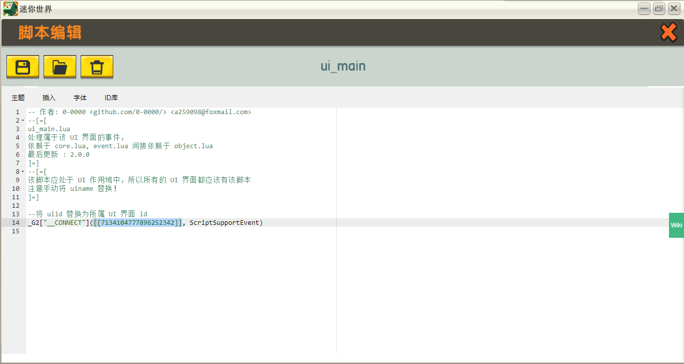

# miniExtend 搭建环境 #
## 初始化全局作用域下的脚本 ##
关于作用域，参见[定义](./document.html#namespace)。  
在全局作用域下，按<a title="源代码开头显示了它们依赖的脚本">一定顺序</a>加入这些脚本。  
脚本所对应的源文件正好为脚本名加上 `.lua` 扩展名，例如 `core` 脚本对应 `core.lua`。  
以下是一个合法的顺序，你可以按照该顺序来创建脚本：  
1. `core`  
2. `time`  
3. `console`  
4. `object`  
5. `event`  
6. `ui`  
直接将源代码复制到脚本中即可，也可以使用来加载源代码。  
完成后界面应如图所示，其中 main 脚本组管理自己的脚本。  
  
图中的脚本和脚本组都是有命名的，这些命名不会影响 miniExtend 正常运行，但良好的命名习惯有利于你在错误发生时及时发现错误的脚本，而不会在错误信息前只有 `[脚本]`。  

## 自定义 UI 环境 ##
对于**所有**  UI 作用域，创建 `ui_main` 脚本，对应源文件为 `ui_main.lua` ，然后将 `uiid` 替换为所属 UI 界面 id 。  
注： UI 界面创建时，对应作用域下可能会自动创建一个<a title="该触发器会使得玩家自动打开该 UI 界面">触发器</a>，创建条件不明，你应该**将其删除**。  
  
  

## 正式开始使用 miniExtend ##
做完以上操作，你已经成功搭建了 miniExtend 环境，现在可以新建脚本使用 miniExtend 功能了。  
注：使用 miniExtend 的脚本**必须位于全局作用域下**，且**位置必须在 miniExtend 脚本之后**，否则无法正常使用 miniExtend 。  
  
### 支持编辑器自动完成 ###
你可以在自己代码中插入 `ide.lua` 中的内容，里面包含了 miniExtend 关键字，这允许你的编辑器自动完成单词。  
  
该步骤完全是可选的。
### 第一个 miniExtend 脚本 ###
接下来我们使用 miniExtend 监听*玩家动作改变*这一事件，事件发生时在日志以 `"tag"` 为标签输出 `"Hello World!"` 。

	Event:connect([[Player.PlayAction]], function(paprm)
		Console:logtag("tag", "Hello, world!");
	end)
