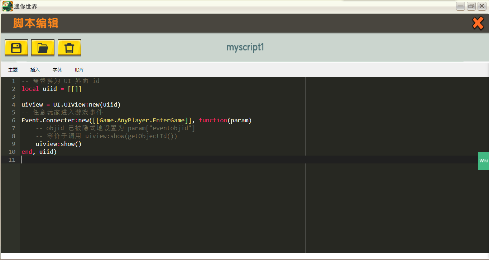

# MiniExtend Object #
对应源文件： *time.lua*  

MiniExtend Object 主要是为 [MiniExtend Event](./event.html) 和 [MiniExtend CustomUI](./ui.html) 设定的。  

目前 MiniExtend Object 内容较少，且主要以理解为主。  
Object 的核心是 `_G2["__OBJID"]` ，以下简称 `objid` 。  
在调用 MiniExtend 的一些函数时， `objid` 会作为游戏对象默认参数（参数名形如 `...id` ，如 `playerid`）。  
注意， MiniExtend 没有 `Object` 这个作用域，以下函数都是全局函数。

### `getObjectId()` 函数 ###
> 返回 `objid` 的值。  
> 你应该使用 `getObjidId()` 函数获取 `objid` 的值，而不是使用 `_G2["__OBJID"]` 。  
### `setObjectId(objectid)` 函数 ###
> 设置 `objid` 的值。  
>
> 如果 `objectid` 的类型为 `number` ，直接设置 `objid` 为 `objectid` ，不会检查 `objectid` 是否合法。  
>
> 如果 `objectid` 的类型为 `table` 且 `objectid["obeventobjid"]` 的类型为 `number` ，设置 `objid` 为 `objectid["eventobjid"]` 。  
> 这在回调函数中非常有用，只需传递回调传递的表参数，就会自动索引 `eventobjid` 并设置 `objid` 。  
>
> 如果 `objid` 类型为其它，函数不做有意义的事。  

## 实例 ##
对于[`UI.UIView:show([playerid])`](./ui.html#UIView-show) 这个函数，你可以不传递 `playerid` 参数调用该函数，这时 `objid` 将代替 `playerid` 参数。  

-- 需替换为 UI 界面 id  
local uiid = [[]]  

uiview = UI.UIView:new(uiid)  
-- 任意玩家进入游戏事件  
Event.Connecter:new([[Game.AnyPlayer.EnterGame]], function(param)  
	-- objid 已被隐式地设置为 param.eventobjid  
	-- 等价于调用 uiview:show(getObjectId())  
	uiview:show()  
end, uiid)  

当任意玩家进入游戏时，玩家会打开 `uiview` 界面。  
