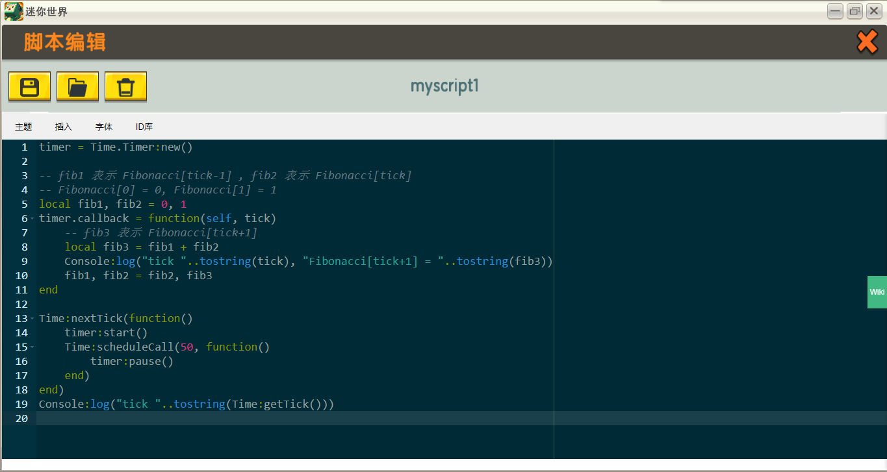
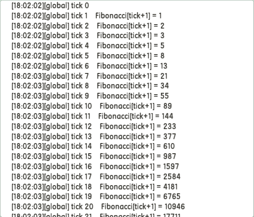

# MiniExtend Time
对应源文件： *time.lua*  

## <code style="color:green;">Time</code> 作用域
### `getTick()` 函数
- 函数返回当前是第几[游戏帧](./document.html#游戏帧)。  
- 只要你立即游戏帧的含义，该函数很容易理解。  

### `scheduleCall(ticks, func, ...)` 函数
- 在 `ticks` 游戏帧后以 `...` 为参数调用函数 `func` 。  
- `ticks` 类型为 `number` 的正整数，会被设置为 `math.max(math.floor(ticks), 1)` 来修正不合法的数值。  
- `func` 类型为 `function` ， MiniExtend 会检查它和 `ticks` 的类型。  
- `...` 类型不限，作为调用 `func` 时传递的实参。  
- 函数不使用多线程，在当前线程执行 `func` ，这可能导致程序阻塞。  

### `nextTick(func, ...)` 函数
- 在下一帧以 `...` 为参数调用函数 `func` 。  
- 等价于 `scheduleCall(1, func, ...);` 。  

注: 如果在延时函数中调用新的延时函数，则新的延时函数从下一帧开始倒计时。  

## `Time.Timer` 类
`Time.Timer` 表示计时器，一个 `Time.Timer` 类表示一个计时器，以下简称 `Timer` 。  
注意，计时器运行时期晚于延时调用(`scheduleCall()`)，在延时调用中启动计时器会使计时器在那一帧运行。  

### 构造函数
使用 `Time.Timer:new()` 来构造一个计时器和相应的 `Timer` 对象，计时器默认是**暂停**的。

### 析构函数
使用 `Time.Timer:delete()` 来删除计时器，这不会删除对象本身。  

### 属性
- `createTime`: `number` 类型，表示对象创建时的 **CPU 时间**。  
- `tick`: `number` 类型，表示对象创建以来计时器**运行**的游戏帧数。  
- `callback`: 有则为 `function` 类型，如果计时器启动，每帧都调用该函数。  
> 回调时传递两个参数: `self` 和 `tick` 。  
> `self` 表示计时器对象。  
> `tick` 表示当前游戏帧。  

### 方法
- `start()`: 启动计时器，如果计时器之前是暂停的返回 `true` ，否则返回 `false` 。  
- `pause()`: 暂停计时器，如果计时器之前是启动的返回 `true` ，否则返回 `false` 。  
- `isRunning()`: 返回计时器是否启动。  

## 综合实例
每一帧都在日志输出当前帧，从第 1 帧开始，额外输出 `Fibonacci[tick+1]` 的值。  
其中 `tick` 表示当前是第几帧。  
从第 50 帧之后，停止输出。  
`Fibonacci`	表示斐波那契数列，它的定义如下:  

- `Fibonacci[0] = 0`  
- `Fibonacci[1] = 1`  
- `Fibonacci[i] = Fibonacci[i-1] + Fibonacci[i-2] (i≥2, i∈N*)`  

timer = Time.Timer:new()  

-- fib1 表示 Fibonacci[tick-1] , fib2 表示 Fibonacci[tick]  
-- Fibonacci[0] = 0, Fibonacci[1] = 1  
local fib1, fib2 = 0, 1  
timer.callback = function(self, tick)  
	-- fib3 表示 Fibonacci[tick+1]  
	local fib3 = fib1 + fib2  
	Console:log("tick "..tostring(tick), "Fibonacci[tick+1] = "..tostring(fib3))  
	fib1, fib2 = fib2, fib3  
end  

Time:nextTick(function()  
    timer:start()  
    Time:scheduleCall(50, function()  
        timer:pause()  
    end)  
end)  
Console:log("tick "..tostring(Time:getTick()))  

