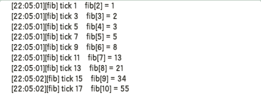
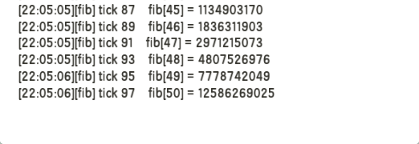

# MiniExtend Time
对应源文件： *time.lua*  

## <code style="color:green;">Time</code> 作用域
### `getTick()` 函数
- 函数返回当前是第几[游戏帧](./document.html#游戏帧)。  
- 只要你立即游戏帧的含义，该函数很容易理解。  

### `scheduleCall(ticks, func, ...)` 函数
- 在 `ticks` 游戏帧后以 `...` 为参数调用函数 `func` 。  
- `ticks`:`{integer}` 会被设置为 `math.max(math.floor(ticks), 1)` 来修正不合法的数值。  
- `func`:`{function}` MiniExtend 会检查它和 `ticks` 的类型。  
- `...`:`{all}` 调用 `func` 时传递的实参。  
- 函数不使用多线程，在当前线程执行 `func` ，这可能导致程序阻塞。  

### `nextTick(func, ...)` 函数
- 在下一帧以 `...` 为参数调用函数 `func` 。  
- 等价于 `scheduleCall(1, func, ...);` 。  

注: 如果在延时回调函数中再调用 `scheduleCall()` 或 `nextTick()` 来延时执行函数，则从下一帧开始倒计时。  

## `Time.Timer` 类
`Time.Timer` 表示计时器，一个 `Time.Timer` 类表示一个计时器，以下简称 `Timer` 。  

注意，计时器运行时期晚于延时回调函数(`scheduleCall()`)。  
在延时回调函数中启动计时器会使计时器在那一帧运行。  
同样， `delay` 值仍会递减，然后判断 `delay` 并调用。  
即使你将 `delay` 设为 0 然后 `delay` 变为 -1 ，仍然正常调用 `callback` 并重置 `delay` 。  

### 构造函数
使用 `Time.Timer:new()` 来构造一个计时器和相应的 `Timer` 对象，计时器默认是**暂停**的。

### 析构函数
使用 `Time.Timer:delete()` 来删除计时器，这不会删除对象本身，仅仅使计时器失去计时功能。  

### 属性
- `createTime`:`{float}` 表示对象创建时的 **CPU 时间**。  
- `tick`:`{integer}` 表示对象创建以来计时器**运行**的游戏帧数。  
- `delay`:`{integer}` 下一次调用 `callback` 的间隔帧数，计时器运行期间每帧减 1 ，降为 0 时恢复为 1 。  
- `callback`:`{function | nil}` 当 `delay` 降为 0 时，调用该函数。  
> 回调时传递两个参数: `self` 和 `tick` 。  
> `self` 表示计时器对象。  
> `tick` 表示当前游戏帧。  

### 方法
- `start()`: 启动计时器，如果计时器之前是暂停的返回 `true` ，否则返回 `false` 。  
- `pause()`: 暂停计时器，如果计时器之前是启动的返回 `true` ，否则返回 `false` 。  
- `isRunning()`: 返回计时器是否启动。  

## 综合实例
首先定义 `tick` 表示当前游戏帧， `i` 的值为 2 。  
从第一帧开始，每隔两帧执行以下操作:  
- 在日志输出当前帧，以及 `Fibonacci[i]` 的值。  
- 将 `i` 的值加 1 。  

`i`=50 以后，停止输出。  
`Fibonacci` 表示斐波那契数列，以下简称 `fib` ，它的定义如下:  

- `fib[0] = 0`  
- `fib[1] = 1`  
- `fib[i] = fib[i-1] + fib[i-2] (i≥2, i∈N*)`  

代码:  
<textarea>
timer = Time.Timer:new()
-- fib1 表示 fib[i-2] , fib2 表示 fib[i-1]
-- fib[0] = 0, fib[1] = 1
local i, fib1, fib2 = 2, 0, 1
-- 另一种方法:
-- timer.calback = function(self, tick)
function timer:callback(tick)
	-- 回调时 delay 已被默认地设为 1 ，因此需要重新设置 delay
	self.delay = 2
	-- fib3 表示 Fibonacci[i]
	local fib3 = fib1 + fib2
	local tickInfo, fibInfo = "tick "..tostring(tick)
	local fibInfo = "fib["..tostring(i).."] = "..tostring(fib3)
	Console:logtag("fib", tickInfo, fibInfo)
	if i >= 50 then
		timer:pause()
	else
		-- 为新的 fib 计算准备
		i, fib1, fib2 = i+1, fib2, fib3
	end
end
-- 另一种方法:
-- Time:scheduleCall(1, function()
Time:nextTick(function()
	-- 计时器运行晚于 nextTick
	-- 在这个 nextTick 回调后的那一帧 timer 就会开始运行
	timer:start()
end)
</textarea>

部分输出如下:  

