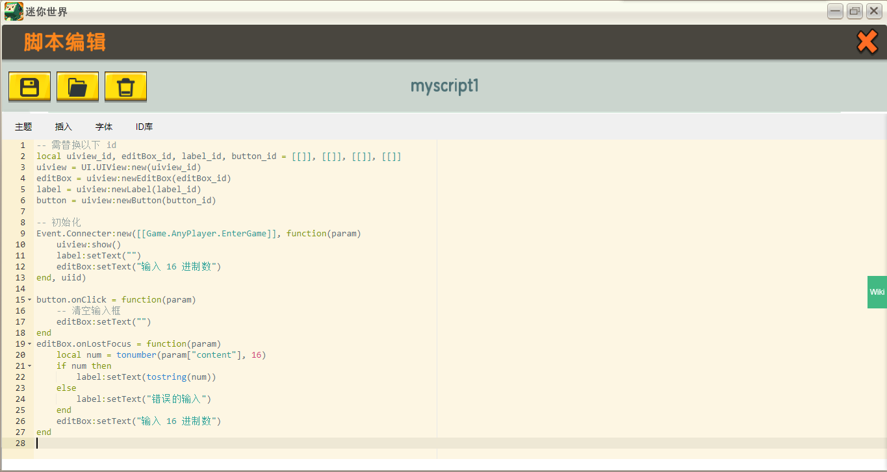

# MiniExtend UI #
对应源文件： *ui.lua*  

## <code style="color:green;">UI</code> 作用域
MiniExtend UI 前身为 `Customui` ，但以面相对象方式描述界面与元件，且支持 [MiniExtend Object](./object.html) 。  
与 UI API 命名冲突，使用 `GameVM.UI` 来访问 API 。  

大多数 `UI` 下的函数都会包含一个 `[, playerid]` 参数，它表示要响应该操作的玩家 id ，该参数不会被检查，如果 `playerid` 的布尔值为 `false` ，则以 `objid` 代替。  
`UI` 下的所有未表明返回值的函数或方法，一律返回 `true` 表示<u title="调用 API 成功不一定代表函数正确工作">调用 API 成功</u>，返回 `false` 表示<u title="只要有一次调用 API 失败">失败</u>。  

## `UI` 下的类之间的关系
| 类名 | 类描述 | 父类 | 具象 |
| :-: | :-: | :-: | :-: |
| UIView | UI 界面 | / | 是 |
| Element | UI 元件 | / | 否 |
| Texture | UI 图片 | Element | 是 |
| Button | UI 按钮 | Texture | 是 |
| Label | UI 文字 | Element | 是 |
| EditBox | UI 输入框 | Label | 是 |

## `UI.UIView` 类
一个 `UI.UIView` 对象代表了一个 UI 界面，以下简称 `UIView` 。  

### 构造函数
- 使用 `UI.UIView:new(uiid);` 来构造一个 `UIView` 对象。  
- `uiid`: `string` 类型，指定该 UI 界面的 id ，该参数不会被检查。  
- 函数返回一个 `UIView` 对象，其 id 属性为 `uiid` 。  
- 如果已经构造过这样的对象则返回之。  

### 属性
- `id`: `string` 类型， UI 界面的 id ，等于构造时传递的 `uiid` 属性。  
- `onShow`: 默认为 `nil` ，如果有则为 `function` 类型，指定当 UI 界面显示时回调的函数，你可以修改它来改变 UI 界面显示时回调的函数。  
- `onHide`: 默认为 `nil` ，如果有则为 `function` 类型，指定当 UI 界面隐藏时回调的函数，类似。注意桌面端玩家可能会按下 `Esc` 键意外地退出 UI 界面。  

### 方法
- <code id="UIView-show">show([playerid])</code> ：使玩家打开该 UI 界面。  
- `hide([playerid])`: 使玩家隐藏该 UI 界面。  
- `setState(state [, playerid])`: 设置该 UI 界面的所有子元件的界面状态为 `state`:`string` 。  
- `newTexture(elementid)`: 构造一个 `UI.Texture` 对象。  
- `newButton(elementid)`: 构造一个 `UI.Button` 对象。  
- `newLabel(elementid)`: 构造一个 `UI.Label` 对象。  
- `newEditBox(elementid)`: 构造一个 `UI.Texture` 对象。  

## UI.Element 类
一个 `UI.Element` 对象代表一个 UI 元件，以下简称 `Element` 。  
该类非具象类，不能直接构造 `Element` 对象，应构造 `Element` 子类的对象。  

### 属性
- `uiView`: `table` 类型，元件所属 `UIView` 对象。  
- `id`: `stirng` 类型，元件的 id ，等于构造该元件对象时传递的 `elementid` 参数。  

### 方法
- `show([playerid])`: 显示该元件。  
- `hide([playerid])`: 隐藏该元件。  
- `setDisplay(display [, playerid])`: 设置元件的显示状态，如果 `display`:`boolean` 为 `true` ，显示元件，否则隐藏元件。  
- `setState(state [, playerid])`: 设置元件的状态为 `state`:`string` 。  
- `setPosition(x, y [, playerid])`: 设置元件的位置为 (`x, y`) 。  
- `setSize(width, height [, playerid])`: 设置元件宽度为 `width` ，高度为 `height` 。  
- `setAngle(angle [, playerid])`: 旋转元件至 `angle`:`number` 角度。  
将 **原始元件(角度为 0 )** 以 **元件位置** 为旋转点 **顺时针** 旋转 `angle` 度得到旋转后的元件。  
- `setColor(color [, playerid])`: 设置元件 RGB 颜色为 `color`:`number` ，取值范围为 `0x000000`~`0xffffff`。  
- `setAlpha(alpha [, playerid]`: 设置元件透明度为 `alpha`:`number` ， 取值范围为 `0`~`100` ，0 为完全透明， 100 为完全不透明。  

## `UI.Texture` 类
一个 `UI.Texture` 对象代表一个 UI 图片元件，以下简称 `Texture` 。  
使用 `UI.Texture:new(uiview, elementid);` 来创建一个 `Texture` 对象，其中 `uiview` 表示元件的父 `UIView` 对象，等价于 `uiview:newTexture(elementid);`。  
### `setTexture(url [, playerid])` 方法
- `url` 的类型为 `string` 。  
- 设置图片的纹理为 `url` 。  
- 可以通过 "ID库" -> "图片" 来获取 `url` 。  

## `UI.Button` 类
一个 `UI.Button` 对象代表一个 UI 图片元件，以下简称 `Button` 。  
使用 `UI.Button:new(uiview, elementid);` 来创建一个 `Button` 对象。  

### `onPress` 属性
- 该属性默认为 `nil` ，如果有则为 `function` 类型，指定当所指按钮被按下时回调的函数，你可以修改它来改变回调的函数。  
- 与 `Event:connect([[ui.onPress]], pressCallBack, uiid)` 类似，会传递 `param` ，但表会额外包含 `element` 键，表示这个 `Button` 对象。  
### `onClick` 属性
- 该属性与 `onPress` 属性类似，但在按钮被点击时回调。  

## `UI.Label` 类
一个 `UI.Label` 对象代表一个 UI 文字元件，以下简称 `Label` 。  
使用 `UI.Label:new(uiview, elementid);` 来创建一个 `Label` 对象。  

### `setFontSize(size [, playerid])` 方法
- `size` 的类型为 `number` ，取值范围为正整数。  
- 设置文本元件的字体大小为 `size` 。  
- 要想知道多大的 `size` 是合适的，你可以在 UI 编辑器中测试。  

### `setText(text [, playerid])` 方法
- `text` 的类型为 `string` 。  
- 设置文本元件显示的文本为 `text` 。  
- 如果 `text` 太长，这似乎不会起作用。  
- 文字不会被屏蔽，但输入框会。  

## `UI.EditBox` 类
一个 `UI.EditBox` 对象代表一个 UI 输入框元件，以下简称 `EditBox` 。  
使用 `UI.EditBox:new(uiview, elementid);` 来创建一个 `EditBox` 对象。  

### `onLostFocus` 属性
- 该属性默认为 `nil` ，如果有则为 `function` 类型，指定当所指输入框失去焦点（可当做玩家完成输入框的输入）时回调的函数，你可以修改它来改变回调的函数。  
- 和 `Button` 类中 `onClock` 属性类似，也会传递 `param` ，且额外包含 `element` 键。  
- 注: `param` 中 `content`:`string` 是事件中最有用的参数，表示输入框输入的信息，即使这不在 MiniExtend 的范围。  
- 如果输入被屏蔽， `content` 也会是屏蔽后的结果。  

## 实例
### 情形
已知一 UI 界面 `u` 下有一个输入框元件 `e` 和一个文字元件 `l` ，要求如下：  

- 在玩家没有输入 `e` 时， `l` 总是显示 `"输入 16 进制数"` ，开始输入时 `e` 的内容清空
- `e` 完成输入时，尝试将其解释为 16 进制数，并转化为 10 进制数，并将结果反应在 `l`上。  
- 如果输入不合法，无法将其转化，则设置 `l` 的文本为 `"错误的输入"`  

### 分析

- 要在开始输入时清空 `e` 的内容，需要处理一个 `ui.onClick` 事件。实现方法是再创建一个按钮元件，设为 `b` ，将 `e` 设为 `b` 的子集，调整 `b` 的外观并将使其刚好覆盖 `e` ，这样当玩家点击输入框开始输入时，也会触发按钮的点击事件，这时就能修改 `e` 的内容了。  
- 经测试，当按钮被点击时焦点才会进入输入框，所以不要使用按下事件。  
- 使用 `tonumber(e [, base])` 函数来转化数字。  

### 代码
以下代码假设已经配置好 UI 了。  
  

-- 需替换以下 id  
local uiview_id, editBox_id, label_id, button_id = [[]], [[]], [[]], [[]]  
uiview = UI.UIView:new(uiview_id)  
editBox = uiview:newEditBox(editBox_id)  
label = uiview:newLabel(label_id)  
button = uiview:newButton(button_id)  

-- 初始化  
Event.Connecter:new([[Game.AnyPlayer.EnterGame]], function(param)  
    uiview:show()  
    label:setText("")  
    editBox:setText("输入 16 进制数")  
end, uiid)  

button.onClick = function(param)  
    -- 清空输入框  
    editBox:setText("")  
end  
editBox.onLostFocus = function(param)  
    local num = tonumber(param["content"], 16)  
    if num then  
        label:setText(tostring(num))  
    else  
        label:setText("错误的输入")  
    end  
    editBox:setText("输入 16 进制数")  
end  
